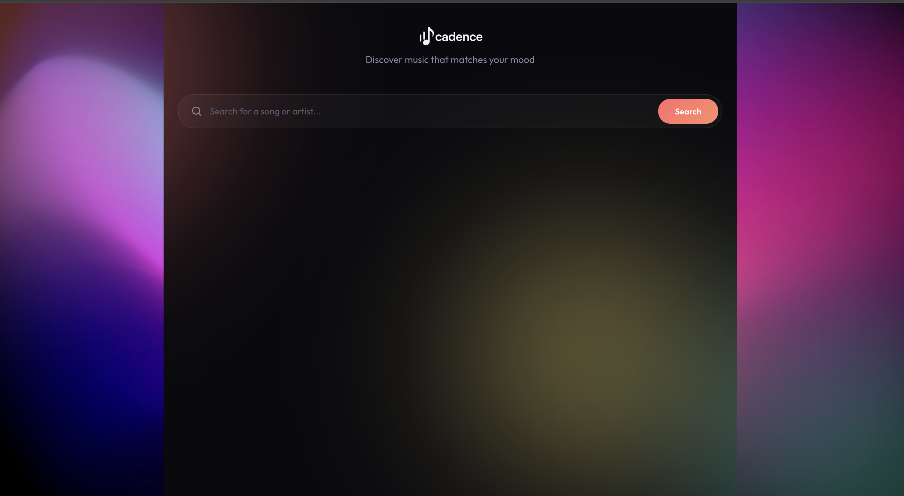
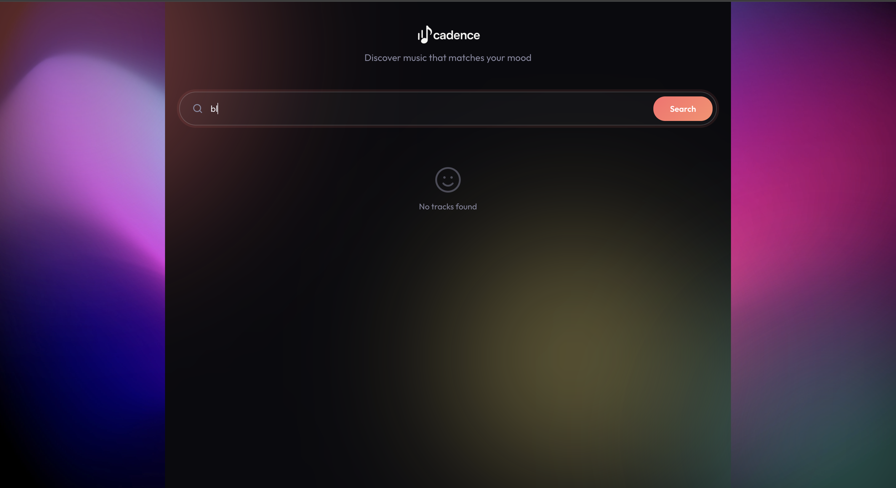
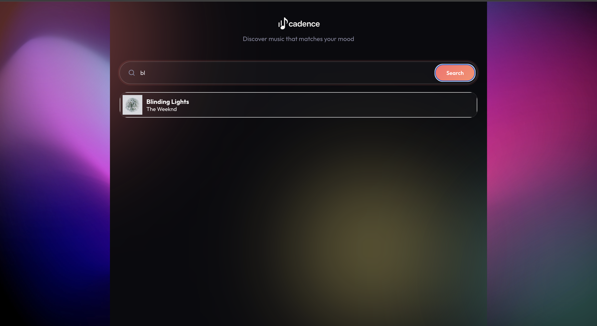
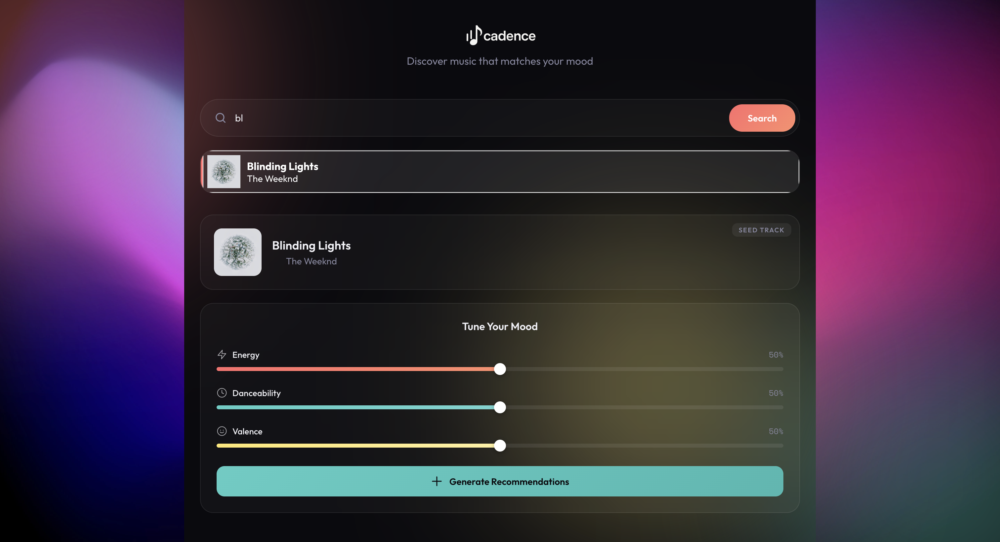
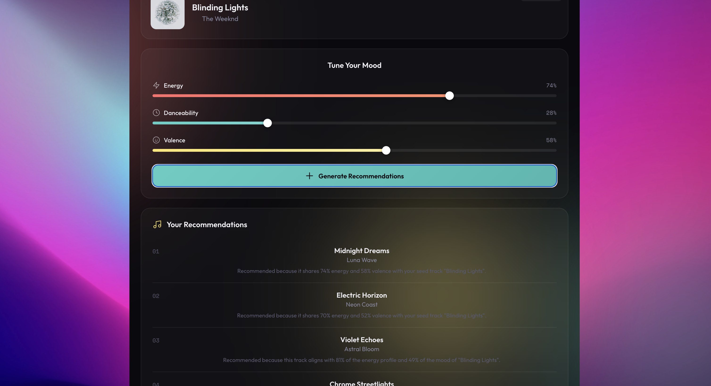
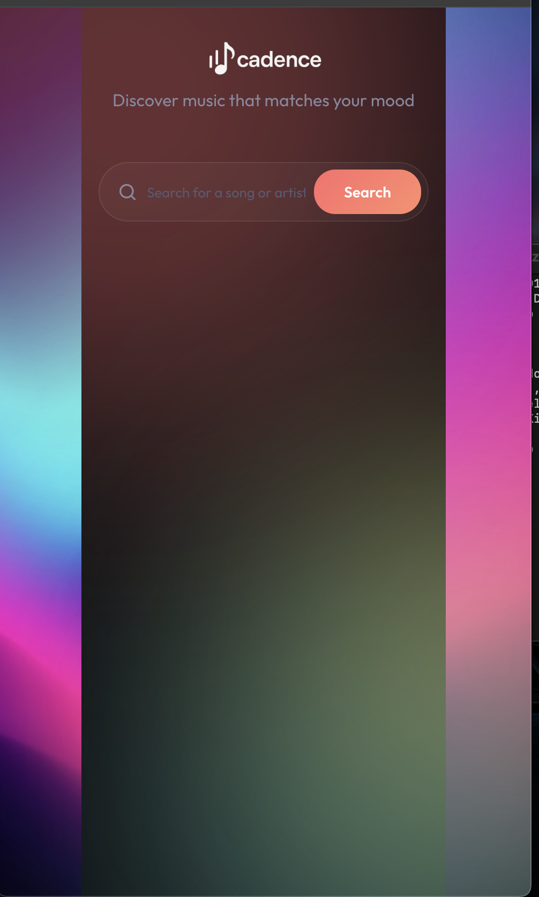
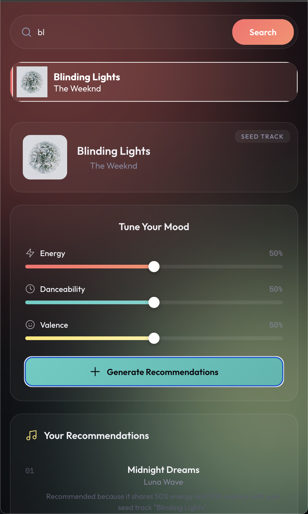

# Al-Waleed's Development Notes

## Features Implemented

### 1. Cadence Branding & Visual Identity

- Added Cadence logo (`public/logo.png`, `public/logo-bg-removed.png`)
- Logo uses `mix-blend-mode: lighten` to blend seamlessly with dark backgrounds

### 2. Glassmorphism UI Design

- Dark theme with semi-transparent surfaces (`rgba(255, 255, 255, 0.03)`)
- `backdrop-filter: blur(20px)` on cards and search bar
- Animated gradient orbs in background using CSS keyframe animations

### 3. Mood Slider System

- Three sliders: Energy, Danceability, Valence
- Each slider has a unique color gradient:
  - Energy: red (`#ff6b6b`)
  - Danceability: teal (`#4ecdc4`)
  - Valence: yellow (`#ffe66d`)
- Custom range input styling with animated fill bars

### 4. Song Recommendations Display

- Numbered list with staggered fade-in animations (`animation-delay`)
- Displays song title, artist, and AI-generated reason for recommendation

### 5. Mock Data System (`src/components/utils.js`)

- `generateSongs()` returns mock recommendations when no Spotify API client is available
- Mock songs include dynamically generated "reason" text based on mood slider values
- Supports both Spotify track format (`.name`) and custom format (`.title`)

---

## Current App.js Setup

The Spotify OAuth flow is currently bypassed for local development:

```javascript
<Searcher token={token} apiClient={null} />
```

- `token`: Passed but may be empty (auth flow has issues)
- `apiClient`: Set to `null`, which triggers mock data in `utils.js`

The original auth logic is preserved as comments in `App.js` for when Spotify integration is ready.

---

## Known Issues / TODOs

- [ ] Spotify OAuth not working — needs valid Client ID and redirect URI configuration
- [ ] When `apiClient` is implemented, update `utils.js` to properly transform Spotify API response
- [ ] Add loading state while generating recommendations
- [ ] Add error handling UI for failed API calls

---

## File Overview

| File                          | Purpose                                |
| ----------------------------- | -------------------------------------- |
| `src/components/Searcher.js`  | Main search page component             |
| `src/components/Searcher.css` | All styling for Searcher               |
| `src/components/utils.js`     | Song generation logic (mock + Spotify) |
| `public/logo-bg-removed.png`  | Cadence logo (transparent)             |

---

## Notes for Teammates

1. **To test the UI**: Just run `npm start` — no Spotify login needed, mock data will load
2. **To enable Spotify**: Set a valid token and pass an axios client as `apiClient` prop to `<Searcher />`
3. **Logo**: Use `logo-bg-removed.png` for the transparent version

## UI Screenshots

### Search 1



### Search 2



### Search 3



### Search 4



### Search 5



### Search 6



### Search 7


### Search 8


